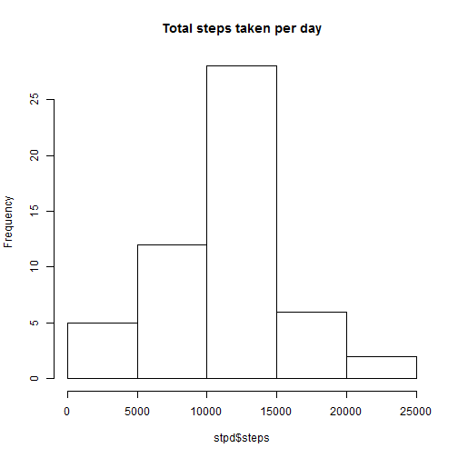
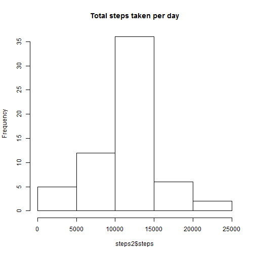
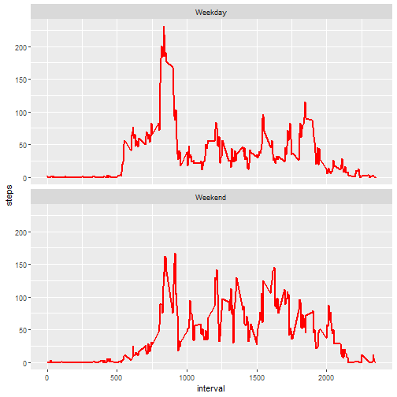

# Reading the data


```r
data= read.csv('activity.csv', stringsAsFactors = F)

data[,2]= as.Date(data[,2])

head(data)
```

```
##   steps       date interval
## 1    NA 2012-10-01        0
## 2    NA 2012-10-01        5
## 3    NA 2012-10-01       10
## 4    NA 2012-10-01       15
## 5    NA 2012-10-01       20
## 6    NA 2012-10-01       25
```

# Steps taken per day


```r
stpd= aggregate(steps~date, data = data, FUN = sum)
hist(stpd$steps, main='Total steps taken per day')
```



```r
mean(stpd$steps)
```

```
## [1] 10766.19
```

```r
median(stpd$steps)
```

```
## [1] 10765
```

# Daily Activity Pattern

```r
series= aggregate(steps~interval, data= data, FUN = mean)
plot(series, type= 'l')
```


```r
series[which.max(series$steps),]
```

```
##     interval    steps
## 104      835 206.1698
```


# Imputing NAs using mean for 5 minute interval


```r
table(is.na(data[,1]))
```

```
## 
## FALSE  TRUE 
## 15264  2304
```

```r
copy = data.frame(data)

for (i in 1:length(copy[,1])){
  
  if (is.na(copy[i,1]) == TRUE){
     
    k= which(series$interval==copy[i,3])
    copy[i,1]= series[k,2]
  }
}

head(copy)
```

```
##       steps       date interval
## 1 1.7169811 2012-10-01        0
## 2 0.3396226 2012-10-01        5
## 3 0.1320755 2012-10-01       10
## 4 0.1509434 2012-10-01       15
## 5 0.0754717 2012-10-01       20
## 6 2.0943396 2012-10-01       25
```

```r
steps2= aggregate(steps~date, data = copy, FUN = sum)
hist(steps2$steps, main='Total steps taken per day')
```



```r
mean(steps2$steps)
```

```
## [1] 10766.19
```

```r
median(steps2$steps)
```

```
## [1] 10766.19
```
### The mean is the same as before since imputation was done using the mean itself. The median now is equal to the mean so the dataset has no skewness after imputation.

### Atfer imputation, there is data for each day and the number of steps taken each day is equal to the mean if that day had all NAs earlier.


# Panel Plot


```r
wd = function(x){
  
  if (x=='Sunday' | x=='Saturday'){
    wd= 'Weekend'
  }
  else{
    wd='Weekday'
  }
  wd
}

copy$day = as.factor(mapply(wd, weekdays(copy[,2])))
head(copy)
```

```
##       steps       date interval     day
## 1 1.7169811 2012-10-01        0 Weekday
## 2 0.3396226 2012-10-01        5 Weekday
## 3 0.1320755 2012-10-01       10 Weekday
## 4 0.1509434 2012-10-01       15 Weekday
## 5 0.0754717 2012-10-01       20 Weekday
## 6 2.0943396 2012-10-01       25 Weekday
```

```r
library(ggplot2)
stpw= aggregate(steps~interval+day, data= copy, FUN = mean)

ggplot(stpw, aes(interval,steps))+facet_wrap(~day, nrow=2, ncol = 1)+geom_line(color='red', size=1)
```


